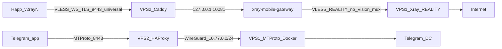

# Protocol

Двухсерверная схема обхода блокировок: входной VPS принимает обычный `VLESS + WebSocket + TLS`, конечный VPS выпускает трафик в интернет через `VLESS + REALITY`.

Клиенты: Windows v2rayN, iOS Happ. Отдельный путь для Telegram — MTProto через HAProxy и WireGuard.

Пошаговая установка входного узла: [REALITY/DEPLOY_MOBILE_GATEWAY_RU.md](REALITY/DEPLOY_MOBILE_GATEWAY_RU.md).  
Конечный REALITY-узел: [REALITY/DEPLOY_VPS_COMMANDS_RU.md](REALITY/DEPLOY_VPS_COMMANDS_RU.md) и `REALITY/deploy_vps.sh`.  
MTProto: [REALITY/DEPLOY_MTPROTO_TWO_VPS_RU.md](REALITY/DEPLOY_MTPROTO_TWO_VPS_RU.md).

`REALITY/README.md` — upstream-документация библиотеки REALITY, не операционный гайд этой схемы.

## Роли

| Роль | Пример сейчас | Скрипт | Публичные порты |
|---|---|---|---|
| VPS-1, конечный egress | Германия `37.220.83.19` | `REALITY/deploy_vps.sh` | TCP `443` (REALITY) |
| VPS-2, входной gateway | Франция `89.208.113.41`, `mythicquality.com` | `REALITY/deploy-wsrelay-vps.sh`, затем `REALITY/deploy-mobile-gateway-vps.sh` | TCP `443` (Caddy), `9443` (VPN), `8443` (MTProto) |
| Клиент | v2rayN / Happ | ссылка с VPS-2 | подключается на `9443/universal` |

Порт `9443` выбран потому, что у части провайдеров TLS ClientHello Xray на `443` зависает, а обычный HTTPS на том же IP живой. `443` остаётся у Caddy (сертификат и `/ws`). `8443` — MTProto, потому что `443` уже занят.

## Схема

```text
Клиент (Happ / v2rayN TUN)
  VLESS + WebSocket + TLS
  SNI/Host = <DOMAIN>
  path = /universal
  порт = 9443
        |
        v
VPS-2 Caddy :9443
  TLS terminate
  /universal*  -> 127.0.0.1:10081   xray-mobile-gateway
  /ws*         -> 127.0.0.1:10080   wsrelay-server (legacy)
        |
        v
xray-mobile-gateway
  inbound:  VLESS + WS, sniffing выключен, WS heartbeat 10s
  outbound: VLESS + REALITY на VPS-1:443
            без xtls-rprx-vision
            mux enabled, xudpProxyUDP443 = allow
        |
        v
VPS-1 Xray :443 REALITY
  клиент email = universal-gateway*  — без flow
  прямые REALITY-клиенты             — с xtls-rprx-vision
  sniffing destOverride выключен
  freedom -> интернет
```



Параллельный legacy-путь Windows raw relay: `wss://<DOMAIN>/ws` → `wsrelay-server` → TCP на VPS-1 `:443`. Основной путь для телефонов и v2rayN — `/universal`.

## Обязательные настройки

Эти значения нельзя «вернуть как в типичном гайде Xray». Именно они ломали Telegram и YouTube.

### 1. Sniffing без destOverride

На **обоих** Xray (вход и выход) `sniffing.enabled = false`.

Почему: Telegram fake-TLS ставит SNI `www.google.com`. `destOverride: [http, tls, quic]` подменяет назначение на Google, в том числе `:5222`. Google не говорит MTProto — клиент крутит переподключение.

`routeOnly` недостаточно, если версия всё равно подменяет адрес. Маршрутов по доменам в этой схеме нет (`domainStrategy: AsIs`), sniffing для routing не нужен.

### 2. Без Vision на hop VPS-2 → VPS-1

Upstream-клиент на VPS-1 с email/label `universal-gateway*` создаётся **без** `flow`.  
Outbound `proxy` на VPS-2 тоже **без** `xtls-rprx-vision`.

Почему: Vision сращивает внутренний TLS 1.3. Через шлюз идёт смешанный трафик (MTProto, HTTPS, UDP). На hop висели сокеты с `Send-Q` 400–500 байт, Telegram вспыхивал и уходил в «обновление».

Прямые клиенты на VPS-1 (не шлюз) по-прежнему с Vision.

`manage-clients.sh add universal-gateway-fr` больше не ставит `flow`. Обычный `add windows-stas` ставит Vision как раньше.

### 3. Mux на outbound шлюза

На VPS-2 outbound `proxy`:

```json
"mux": {
  "enabled": true,
  "concurrency": 8,
  "xudpConcurrency": 16,
  "xudpProxyUDP443": "allow"
}
```

Почему: Happ TUN без mux открывает новый REALITY на каждый TCP. Набиралось 70+ туннелей, живые сессии тонули. Mux сжимает hop до нескольких сокетов.

`xudpProxyUDP443` должен быть `allow`. Значение `reject` режет YouTube QUIC (UDP 443).

### 4. Caddy: длинный WebSocket

`reverse_proxy` на `10081` и `10080`:

- `flush_interval -1`
- `transport http { versions 1.1; read_timeout 0; write_timeout 0; dial_timeout 10s }`

Почему: дефолтные таймауты Caddy рвали WS примерно через 30 секунд. Между Caddy и Xray копились `CLOSE-WAIT` / `FIN-WAIT-2`. Приложения «жили полминуты и умирали».

Директива `protocols h1 h2` внутри сайта в текущем Caddy **невалидна** — не использовать.

На inbound шлюза: `wsSettings.heartbeatPeriod = 10`.

### 5. Уникальный email клиента

Xray 26+ отвергает два клиента с одним `email`. `manage-mobile-clients.sh` и `manage-clients.sh` отказываются добавить дубль.

### 6. DNS и hosts

A-запись `<DOMAIN>` должна указывать на IP VPS-2.  
На рабочих станциях Windows не должно быть строки в `hosts` со старым IP (был случай `193.22.244.37 mythicquality.com` — MTProto и проверки по домену уходили на мёртвый VPS).

Публичный DNS (`1.1.1.1` / `8.8.8.8`) и локальный `hosts` надо сверять отдельно.

## Клиенты

Ссылки выдаёт только VPS-2:

```bash
sudo ./manage-mobile-clients.sh links
```

Не присылай ссылки и секреты в чат.

В Happ / v2rayN:

- TUN на весь трафик, не TCP-only;
- UDP включён;
- IPv6 либо через TUN, либо блокировать (иначе YouTube уходит мимо VPN);
- в v2rayN `XudpProxyUDP443 = proxy`, в sing-box не должно быть `udp:443 → reject`.

YouTube проверяй в Safari по `https://www.youtube.com`, не только приложением.

## MTProto (отдельно от VPN)

```text
Telegram
  -> VPS-2 :8443 HAProxy
  -> WireGuard 10.77.0.1 <-> 10.77.0.2
  -> VPS-1 Docker telegrammessenger/proxy на 10.77.0.2:8443
```

Ссылку брать на VPS-1: `sudo ./deploy-mtproto-two-vps.sh links`.  
В Telegram нужен TLS-style секрет (начинается с `dd`), хост — IP VPS-2 или домен, порт `8443`.  
Пока Happ TUN включён, проверка MTProto бессмысленна: прокси уйдёт в VPN. Сначала выключи VPN.

## Переезд на новые серверы

Порядок важен: сначала VPS-1, потом VPS-2.

### 1. Конечный узел (как Германия)

На новом VPS-1, из корня репозитория:

```bash
cd ~/protocol
# SERVER_IP — публичный IPv4 этого VPS
sudo SERVER_IP='<VPS1_PUBLIC_IP>' bash REALITY/deploy_vps.sh
```

Скрипт ставит Xray REALITY на `:443`, sniffing без destOverride, первого клиента `admin` с Vision.

Создай upstream для шлюза **без Vision**:

```bash
cd ~/protocol/REALITY
sudo ./manage-clients.sh add universal-gateway-fr
```

Сохрани из вывода: UUID, SNI, Public Key, Short ID. Приватный ключ REALITY с VPS-1 никуда не копировать.

### 2. Входной узел (как Франция)

DNS: A `<DOMAIN>` → IP VPS-2. AAAA не заводить, если IPv6 на VPS-2 не слушает VPN.

```bash
cd ~/protocol
git pull
cd REALITY
chmod +x deploy-wsrelay-vps.sh deploy-mobile-gateway-vps.sh manage-mobile-clients.sh

sudo ./deploy-wsrelay-vps.sh install --domain <DOMAIN>

sudo ./deploy-mobile-gateway-vps.sh install \
  --domain <DOMAIN> \
  --public-address <VPS2_PUBLIC_IP> \
  --public-port 9443 \
  --tls-pin-sha256 '<TLS_CA_SHA256>' \
  --path /universal \
  --origin <VPS1_PUBLIC_IP>:443 \
  --upstream-uuid '<UUID_universal-gateway-fr>' \
  --server-name '<REALITY_SNI>' \
  --public-key '<REALITY_PUBLIC_KEY>' \
  --short-id '<REALITY_SHORT_ID>'
```

Скрипт сам ставит: sniffing off, без Vision на outbound, mux + UDP 443, heartbeat WS, Caddy с длинным `reverse_proxy`.

Открой firewall: TCP `80`, `443`, `9443`, при MTProto ещё `8443`; UDP WireGuard `51821` только с IP парного VPS.

Клиентов заведи на VPS-2:

```bash
sudo ./manage-mobile-clients.sh add windows-stas
sudo ./manage-mobile-clients.sh add iphone-stas
```

Старые ссылки с прошлого IP/порта недействительны, если сменился адрес или UUID.

### 3. Проверка после переезда

На VPS-2:

```bash
sudo systemctl is-active caddy xray-mobile-gateway wsrelay-server
curl -I --max-time 15 "https://<DOMAIN>:9443/universal"
sudo ss -tnp | grep ESTAB | grep '<VPS1_IP>:443'
```

На hop к VPS-1 должно быть несколько сокетов и в основном `Send-Q 0`. Пачка `Send-Q` 400–500 — снова клинч Vision/mux.

На VPS-1 после включения VPN на телефоне:

```bash
sudo journalctl -u xray --since "1 min ago" --no-pager -l | grep universal-gateway
```

Ожидаемо: `2ip.ru` / `api.ipify.org` через клиент показывают IP VPS-1. Telegram и YouTube (Safari) держатся дольше минуты.

## Диагностика коротко

| Симптом | Куда смотреть |
|---|---|
| Telegram стучится в `www.google.com:5222` | sniffing destOverride на любом из Xray |
| Telegram 30 с живой, потом «обновление»; на VPS-2 `Send-Q` 400+ к VPS-1 | Vision на hop или mux выключен |
| Всё отваливается разом раз в ~30 с; много `CLOSE-WAIT` на `:10081` | Caddy таймауты WebSocket |
| YouTube нет в логах VPS-1, нет `udp:` | клиент: TUN/UDP/IPv6 |
| YouTube есть `udp:*:443`, ролик не идёт | `xudpProxyUDP443` не `allow` |
| MTProto не цепляется, VPN выключен | DNS/hosts домена, порт `8443`, секрет `dd` |
| `xray-mobile-gateway` crash, `config.json` 0 байт | писать конфиг через temp + `install`, не сырой redirect |

## Файлы

| Файл | Назначение |
|---|---|
| `REALITY/deploy_vps.sh` | VPS-1: REALITY egress |
| `REALITY/manage-clients.sh` | клиенты VPS-1; `universal-gateway*` без flow |
| `REALITY/deploy-wsrelay-vps.sh` | VPS-2: Caddy + `/ws` |
| `REALITY/deploy-mobile-gateway-vps.sh` | VPS-2: `/universal` gateway |
| `REALITY/manage-mobile-clients.sh` | UUID и ссылки клиентов на VPS-2 |
| `REALITY/deploy-mtproto-two-vps.sh` | MTProto два VPS |
| `REALITY/check-universal-traffic.sh` | трафик клиентов шлюза |
| `REALITY/check-traffic.sh` | лимиты на VPS-1 |

Не коммить `gateway.env`, `config.json`, `client-links.txt`, ключи WireGuard, MTProto secret, `.env`.
